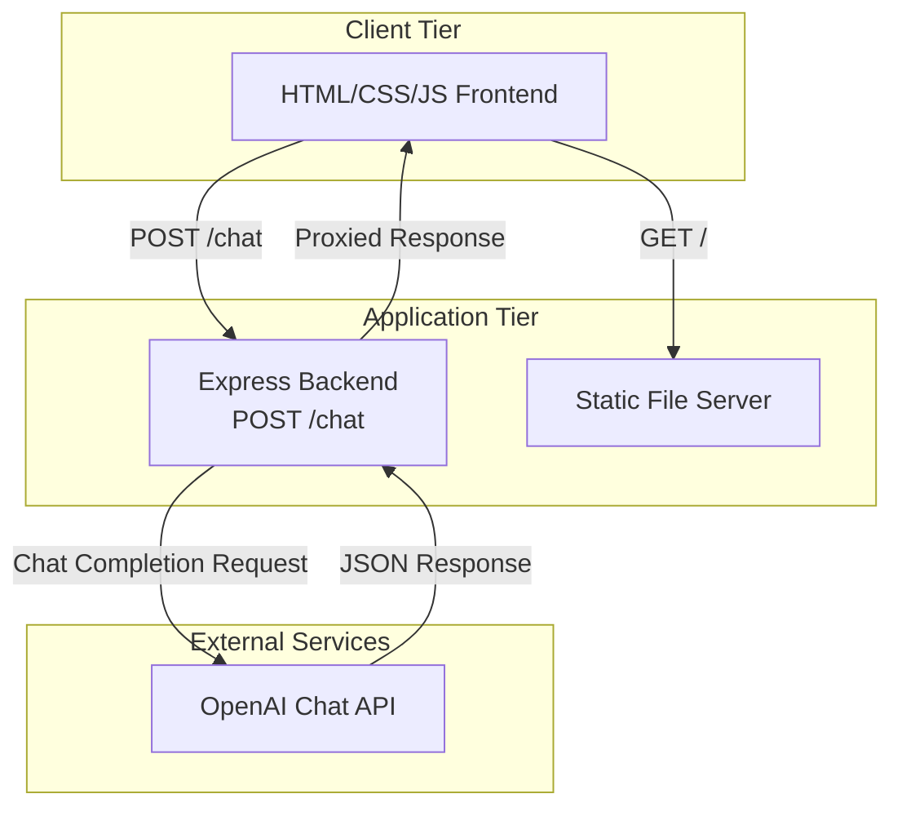

# Design Document

## Overview

The chatgpt-chatbot-webapp is a full-stack web application that provides an intuitive interface for interacting with OpenAI's Chat Completions API. The application follows a traditional client-server architecture where the frontend handles user interactions and display, while the backend manages API authentication and request proxying.

The design emphasizes simplicity and clarity, using vanilla web technologies (HTML, CSS, JavaScript) for the frontend and Node.js with Express for the backend. This approach minimizes dependencies while providing a robust foundation for chatbot interactions.

Key design goals:
- Secure API key management through backend proxying
- Clean separation between presentation and business logic
- Responsive user experience with proper loading and error states
- Extensible model selection supporting current and future GPT models

## Architecture

The application uses a three-tier architecture:



### Communication Flow

1. User interacts with the frontend UI (index.html)
2. Frontend validates input and sends POST request to backend /chat endpoint
3. Backend validates request, constructs OpenAI API payload
4. Backend forwards request to OpenAI Chat Completions API
5. Backend receives response and proxies it back to frontend
6. Frontend displays both raw JSON and formatted message

### Technology Stack

- **Frontend**: HTML5, CSS3, Vanilla JavaScript (ES6+)
- **Backend**: Node.js (v14+), Express.js
- **API Client**: OpenAI Node.js SDK or native fetch/axios
- **Configuration**: dotenv for environment variable management
- **Deployment**: Static files served from Express

## Components and Interfaces

### Frontend Components

#### 1. Input Form Component
Manages user input collection and validation.

**Responsibilities:**
- Render input fields (query textarea, system prompt textarea, model selector)
- Validate user query is non-empty before submission
- Disable/enable submit button based on request state
- Display validation errors

**State:**
```javascript
{
  query: string,
  systemPrompt: string,
  selectedModel: string,
  isLoading: boolean,
  error: string | null
}
```

#### 2. Response Display Component
Handles rendering of API responses.

**Responsibilities:**
- Display raw JSON response in formatted code block
- Extract and display assistant message
- Show loading indicator during requests
- Display error messages

**State:**
```javascript
{
  rawResponse: object | null,
  formattedMessage: string | null,
  isLoading: boolean,
  error: string | null
}
```

#### 3. API Client Module
Manages communication with backend.

**Interface:**
```javascript
async function sendChatRequest(query, systemPrompt, model) {
  // Returns: { success: boolean, data?: object, error?: string }
}
```

### Backend Components

#### 1. Express Server
Main application server handling HTTP requests.

**Configuration:**
- Port: from environment variable PORT (default: 3000)
- Static file serving from /public directory
- JSON body parsing middleware
- CORS configuration (if needed)

#### 2. Chat Endpoint Handler
Processes chat requests and proxies to OpenAI.

**Endpoint:** `POST /chat`

**Request Schema:**
```json
{
  "query": "string (required)",
  "systemPrompt": "string (optional)",
  "model": "string (required)"
}
```

**Response Schema (Success):**
```json
{
  "rawResponse": {
    "id": "string",
    "object": "chat.completion",
    "created": "number",
    "model": "string",
    "choices": [
      {
        "index": "number",
        "message": {
          "role": "assistant",
          "content": "string"
        },
        "finish_reason": "string"
      }
    ],
    "usage": {
      "prompt_tokens": "number",
      "completion_tokens": "number",
      "total_tokens": "number"
    }
  },
  "message": "string"
}
```

**Response Schema (Error):**
```json
{
  "error": "string"
}
```

**Status Codes:**
- 200: Successful response
- 400: Invalid request (missing required fields)
- 500: Server error or OpenAI API error

#### 3. OpenAI Integration Module
Encapsulates OpenAI API communication.

**Interface:**
```javascript
async function callOpenAI(messages, model) {
  // Returns: OpenAI API response object
  // Throws: Error with descriptive message on failure
}
```

**Configuration:**
- API Key: from environment variable OPENAI_API_KEY
- Endpoint: OpenAI Chat Completions API
- Request format: OpenAI SDK or direct HTTP

## Data Models

### Chat Request Model
```javascript
{
  query: string,           // User's question or message (required, non-empty)
  systemPrompt: string,    // System instructions (optional, defaults to empty)
  model: string            // GPT model identifier (required, must be valid)
}
```

### OpenAI Messages Array
```javascript
[
  {
    role: "system",
    content: string        // systemPrompt value
  },
  {
    role: "user",
    content: string        // query value
  }
]
```

### OpenAI API Request
```javascript
{
  model: string,           // Selected GPT model
  messages: [              // Array of message objects
    { role: string, content: string }
  ]
}
```

### OpenAI API Response
```javascript
{
  id: string,
  object: "chat.completion",
  created: number,
  model: string,
  choices: [
    {
      index: number,
      message: {
        role: "assistant",
        content: string
      },
      finish_reason: string
    }
  ],
  usage: {
    prompt_tokens: number,
    completion_tokens: number,
    total_tokens: number
  }
}
```

### Application Response Model
```javascript
{
  rawResponse: object,     // Complete OpenAI API response
  message: string          // Extracted assistant message content
}
```

### Error Response Model
```javascript
{
  error: string            // Human-readable error description
}
```


### UI State Model
```javascript
{
  // Input state
  query: string,
  systemPrompt: string,
  selectedModel: string,
  
  // Request state
  isLoading: boolean,
  
  // Response state
  rawResponse: object | null,
  formattedMessage: string | null,
  
  // Error state
  error: string | null
}
```

### Environment Configuration Model
```javascript
{
  OPENAI_API_KEY: string,  // Required, no default
  PORT: number             // Optional, defaults to 3000
}
```

## Correctness Properties

*A property is a characteristic or behavior that should hold true across all valid executions of a system—essentially, a formal statement about what the system should do. Properties serve as the bridge between human-readable specifications and machine-verifiable correctness guarantees.*

### Property Reflection

After analyzing all acceptance criteria, I identified the following testable properties. Many criteria are either examples (testing specific UI elements exist) or edge cases (handled by property test generators). The following properties represent universal behaviors that should hold across all inputs:

**Redundancy Analysis:**
- Properties 2.1 and 2.2 overlap: validating empty queries and displaying errors can be combined into one property about input validation
- Properties 3.1 and 3.2 are related but distinct: one tests raw response display, the other tests message extraction
- Properties 5.2 and 5.3 could be combined: both test response handling, but they validate different aspects (raw vs extracted)
- Properties 10.1 and 10.2 are related: both ensure model name passthrough, can be combined into one end-to-end property

**Consolidated Properties:**
After reflection, I've consolidated overlapping properties and focused on unique validation value.

### Property 1: Empty Query Validation

*For any* query string that is empty or contains only whitespace, the frontend validation should reject it and display an error message without sending a request to the backend.

**Validates: Requirements 2.1, 2.2**

### Property 2: Valid Request Payload Structure

*For any* valid query, system prompt, and model selection, the POST request to /chat should contain a JSON payload with all three fields (query, systemPrompt, model).

**Validates: Requirements 2.3**

### Property 3: Loading State Management

*For any* request submission, the frontend should set isLoading to true when the request starts and disable the submit button until the response arrives.

**Validates: Requirements 2.4, 2.5**

### Property 4: Response Display Completeness

*For any* successful backend response, the frontend should display both the complete raw JSON response and the extracted assistant message.

**Validates: Requirements 3.1, 3.2**

### Property 5: Response Persistence During Transition

*For any* existing response, when a new request is submitted, the previous response should remain visible in the UI until the new response arrives.

**Validates: Requirements 3.4**

### Property 6: Error Display

*For any* error response (network error, validation error, or API error), the frontend should display an error message to the user without crashing.

**Validates: Requirements 3.5, 9.1, 9.4**

### Property 7: Backend Request Validation

*For any* POST request to /chat that is missing required fields (query or model), the backend should return an HTTP 400 status with a descriptive error message.

**Validates: Requirements 4.3**

### Property 8: Messages Array Construction

*For any* valid chat request with query and systemPrompt, the backend should construct a messages array with exactly two elements: a system message containing the systemPrompt and a user message containing the query.

**Validates: Requirements 4.4**

### Property 9: Model Name Passthrough

*For any* model name selected in the frontend, the backend should pass that exact model name to the OpenAI API without modification.

**Validates: Requirements 4.5, 10.1, 10.2**

### Property 10: API Key Inclusion

*For any* request to the OpenAI API, the backend should include the API_Key from environment variables in the authentication header.

**Validates: Requirements 5.1**

### Property 11: Response Proxying

*For any* successful OpenAI API response, the backend should return both the complete raw response and the extracted assistant message content to the frontend.

**Validates: Requirements 5.2, 5.3**

### Property 12: Error Propagation

*For any* error returned by the OpenAI API, the backend should return an HTTP 500 status with error details to the frontend, and log the error to the console.

**Validates: Requirements 5.4, 9.5**

### Property 13: Invalid Request Error Handling

*For any* invalid request to the backend, the backend should return a descriptive error message that helps the user understand what went wrong.

**Validates: Requirements 9.2**

### Property 14: Model Selection Persistence

*For any* model selected from the dropdown, the frontend should maintain that selection as the displayed value for subsequent requests until the user changes it.

**Validates: Requirements 10.4, 10.5**

### Property 15: Invalid Model Error Propagation

*For any* invalid model name sent to the OpenAI API, the error response should be propagated back to the frontend and displayed to the user.

**Validates: Requirements 10.3**

## Error Handling

### Frontend Error Handling

**Input Validation Errors:**
- Empty query: Display inline error message "Please enter a query"
- Network errors: Display "Unable to connect to server. Please try again."
- Timeout errors: Display "Request timed out. Please try again."

**API Error Handling:**
- Parse error responses from backend
- Display error.message or generic fallback
- Clear loading state
- Re-enable submit button
- Log errors to console for debugging

**Error Display Strategy:**
- Use dedicated error message container
- Style errors distinctly (red text or border)
- Clear previous errors before new requests
- Preserve error messages until user takes action

### Backend Error Handling

**Request Validation Errors (400):**
- Missing query field: "Query is required"
- Missing model field: "Model selection is required"
- Invalid JSON: "Invalid request format"

**OpenAI API Errors (500):**
- Authentication errors: "API authentication failed"
- Rate limit errors: "Rate limit exceeded. Please try again later."
- Invalid model errors: "Selected model is not available"
- Network errors: "Failed to connect to OpenAI API"
- Generic errors: Include OpenAI error message when available

**Error Logging:**
- Log all errors to console with timestamp
- Include request details (without sensitive data)
- Include full error stack traces for debugging

**Error Response Format:**
```javascript
{
  error: string,           // User-friendly error message
  details?: string         // Optional technical details
}
```

### Configuration Errors

**Missing API Key:**
- Log error: "OPENAI_API_KEY not found in environment variables"
- Prevent server startup
- Exit with non-zero status code

**Invalid Port:**
- Fall back to default port 3000
- Log warning about fallback

## Testing Strategy

### Dual Testing Approach

This application requires both unit testing and property-based testing to ensure comprehensive correctness:

**Unit Tests** verify specific examples, edge cases, and integration points:
- Specific UI elements exist with correct attributes
- Specific error messages for known error conditions
- Configuration loading with and without environment variables
- Static file serving from public directory
- Project structure and file existence

**Property-Based Tests** verify universal properties across all inputs:
- Input validation works for all possible query strings
- Request payload structure is correct for all valid inputs
- Response handling works for all possible API responses
- Error propagation works for all error types
- State management works across all state transitions

Together, these approaches provide comprehensive coverage: unit tests catch concrete bugs in specific scenarios, while property tests verify that general correctness properties hold across the entire input space.

### Property-Based Testing Configuration

**Library Selection:**
- **JavaScript/Node.js**: Use `fast-check` library for property-based testing
- Install: `npm install --save-dev fast-check`

**Test Configuration:**
- Each property test MUST run minimum 100 iterations
- Use fast-check's `fc.assert` with `fc.property`
- Configure: `{ numRuns: 100 }` or higher for complex properties

**Test Tagging:**
Each property-based test MUST include a comment tag referencing the design document property:

```javascript
// Feature: chatgpt-chatbot-webapp, Property 1: Empty Query Validation
test('empty or whitespace queries are rejected', () => {
  fc.assert(
    fc.property(fc.string(), (query) => {
      // Test implementation
    }),
    { numRuns: 100 }
  );
});
```

**Property Test Implementation:**
- Each correctness property MUST be implemented by exactly ONE property-based test
- Tests should use appropriate generators (fc.string(), fc.object(), etc.)
- Tests should verify the property holds across generated inputs
- Tests should fail fast with clear error messages

### Unit Testing Strategy

**Frontend Unit Tests:**
- Test that required UI elements exist (textareas, button, select)
- Test that placeholder text matches requirements
- Test that model options are correctly populated
- Test error message display for empty query
- Test loading indicator visibility
- Test button disabled state during loading
- Mock fetch API for request testing

**Backend Unit Tests:**
- Test /chat endpoint exists and accepts POST requests
- Test 400 error for missing query field
- Test 400 error for missing model field
- Test messages array construction with various inputs
- Test API key loading from environment
- Test port configuration with default fallback
- Test server startup failure when API key missing
- Mock OpenAI API for integration testing

**Integration Tests:**
- Test complete request/response cycle with mocked OpenAI API
- Test error propagation from OpenAI through backend to frontend
- Test static file serving

**Test Framework:**
- Use Jest or Vitest for both frontend and backend tests
- Use supertest for backend endpoint testing
- Use jsdom for frontend DOM testing

### Test Coverage Goals

- Unit test coverage: 80%+ for critical paths
- Property test coverage: All 15 correctness properties implemented
- Integration test coverage: All major user flows
- Error handling: All error paths tested

### Testing Execution

**Development:**
```bash
npm test              # Run all tests
npm run test:unit     # Run unit tests only
npm run test:property # Run property-based tests only
npm run test:watch    # Watch mode for development
```

**CI/CD:**
- Run all tests on every commit
- Fail build if any test fails
- Generate coverage reports
- Property tests run with 100+ iterations in CI

